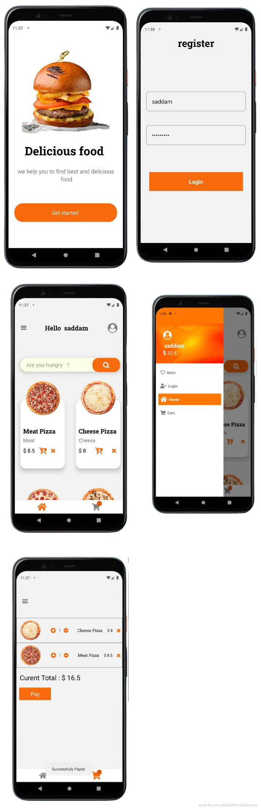

## React Native food App

A simple cross platform (Android) React Native food App. 
 
 

## App Screens
---
 

### Installation

> **Note:** Be sure you have the React Native expo [installed on your system](https://reactnative.dev/docs/environment-setup).

- `git clone git@github.com:saddam-maratouq/R.N-FoodApp.git`
- `yarn install`/`npm install`

### Running

- `expo Start / expo start --android`

---

## Digram

